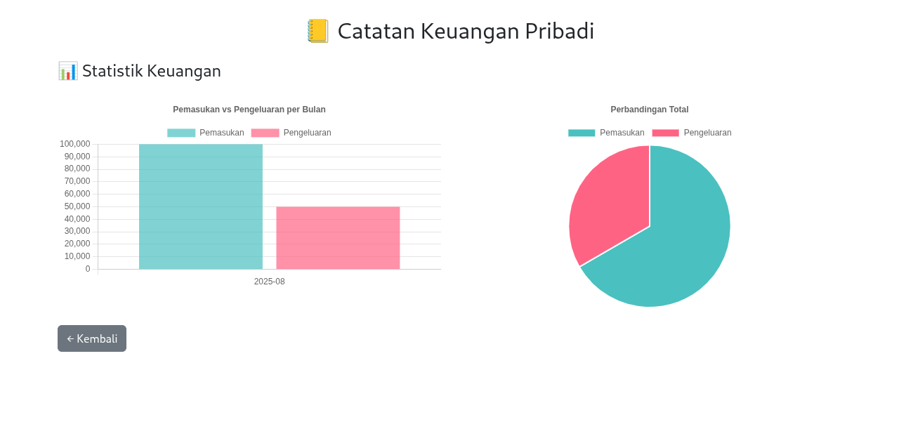
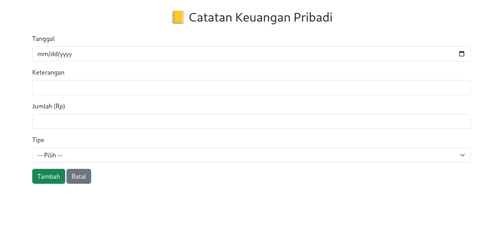
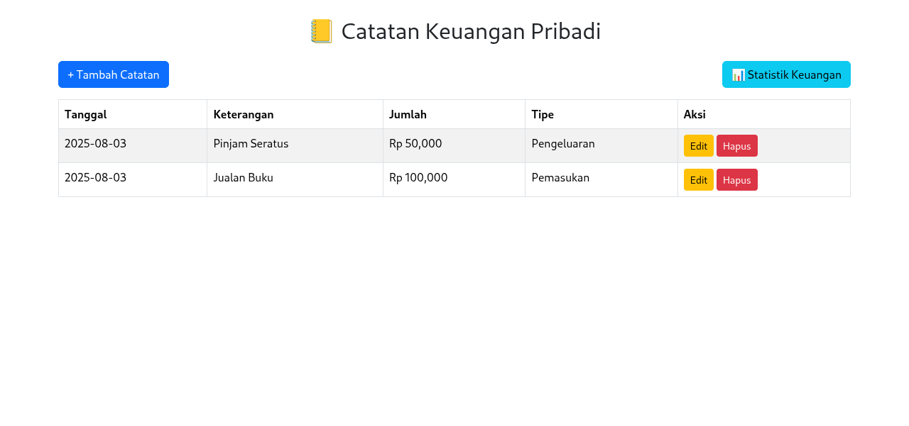

# 📒 Personal Finance Tracker (catatan-keuangan)

A simple yet powerful **personal finance tracker** built with **Flask**, **SQLite**, **Bootstrap**, and **Chart.js**. This web app allows you to **add, edit, delete, and visualize** your income and expenses with ease.

<div align="center">
  
  <p><em>📊 Dashboard overview with summary and navigation</em></p>
</div>
---

## ✨ Features

- 📥 Add and edit transactions (income or expenses)
- 📊 Visualize monthly trends with bar and pie charts
- 📋 View transaction history in a clean table format
- 🎨 Responsive UI with Bootstrap CDN
- ⚡ Lightweight and easy to deploy

---

## 🖥️ Screenshots

<table align="center">
  <tr>
    <td align="center">
      <br/>
      <em>➕ Add/Edit transaction form</em>
    </td>
    <td align="center">
      <br/>
      <em>📋 Transaction table with actions</em>
    </td>
  </tr>
  <tr>
    <td colspan="2" align="center">
      <br/>
      <em>📊 Dashboard showing financial summary and charts</em>
    </td>
  </tr>
</table>

---

## 🚀 Getting Started

### Prerequisites

- Python 3.x installed
- `pip` for managing dependencies

### Installation

```bash
# Clone this repository
git clone https://github.com/yourusername/catatan-keuangan.git
cd catatan-keuangan

# (Optional) Create a virtual environment
python -m venv venv
source venv/bin/activate  # On Windows: venv\Scripts\activate

# Install dependencies
pip install -r requirements.txt

# Run the app
python app.py
````

Then open your browser and navigate to [http://localhost:5000](http://localhost:5000)

---

## 📂 Project Structure

```
catatan-keuangan/
 ┣ 📂static/               # Images for README & assets
 ┃ ┣ 📜FormInput-Edit.png
 ┃ ┣ 📜Tabel.png
 ┃ ┗ 📜dashboard.png
 ┣ 📂templates/            # HTML templates
 ┃ ┣ 📜base.html
 ┃ ┣ 📜chart.html
 ┃ ┣ 📜form.html
 ┃ ┗ 📜index.html
 ┣ 📜app.py                # Main Flask app
 ┣ 📜keuangan.db           # SQLite database file
 ┗ 📜requirements.txt      # Python dependencies
```

---

## 📈 Charts & Analytics

The `/chart` page provides insightful visualizations using Chart.js:

* **Bar Chart**: Monthly income vs expense
* **Pie Chart**: Overall financial breakdown

---

## 📜 License

This project is licensed under the **MIT License** — see the [LICENSE](LICENSE) section below for details.

---

## ❤️ Contributing

Feel free to fork this repository and submit a pull request! If you have suggestions, open an issue — collaboration is welcome.

---

## 👨‍💻 Author

**Cs-Blu3Eye** — Built with love and Python.
